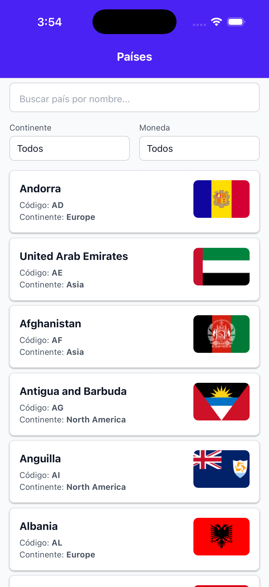
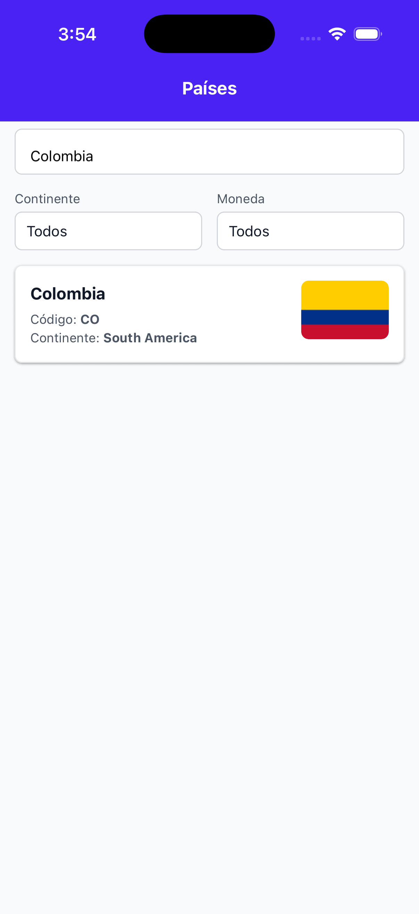
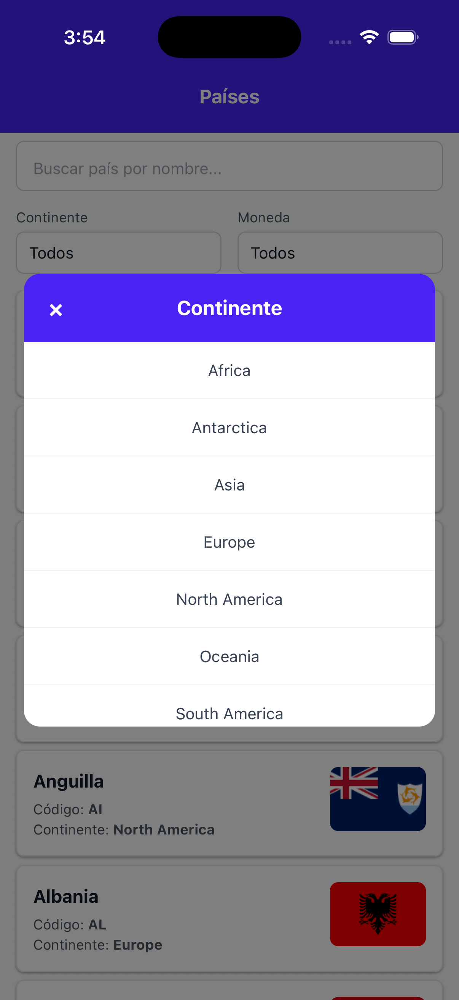
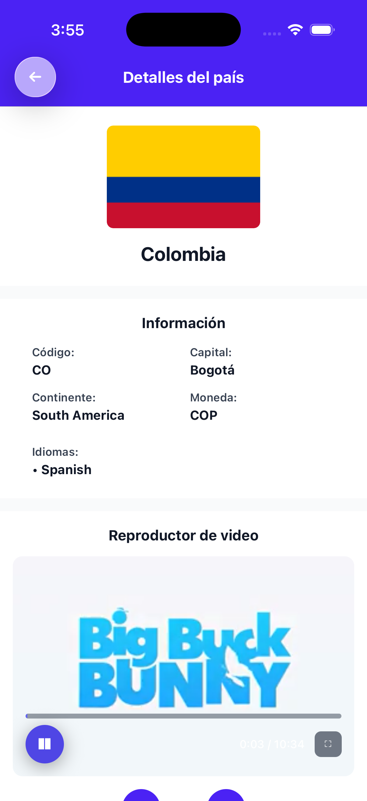

# CrehanaCountries

Aplicación móvil de React Native que muestra información de países consumiendo una API GraphQL, con reproductor de video HLS integrado.

## Arquitectura

El proyecto sigue una **arquitectura limpia monolítica modular por capas**, separando responsabilidades y facilitando mantenibilidad y testing.

## Estructura del proyecto
```bash
src/
├── app/
├── assets/
│   └── icons/
├── core/
│   ├── components/
│   ├── config/
│   ├── hooks/
│   │   └── __testUtils__/
│   ├── navigation/
│   └── utils/
├── modules/
│   ├── countries/
│   │   ├── data/
│   │   │   ├── graphql/
│   │   │   ├── mappers/
│   │   │   └── repositories/
│   │   ├── di/
│   │   ├── domain/
│   │   │   ├── models/
│   │   │   └── repositories/
│   │   └── presentation/
│   │       ├── components/
│   │       ├── hooks/
│   │       ├── screens/
│   │       └── utils/
│   └── video/
│       ├── data/
│       │   └── providers/
│       ├── domain/
│       │   └── models/
│       └── presentation/
│           ├── components/
│           └── hooks/
└── types/
```

#### Principios Aplicados

- **Separation of Concerns**: Cada capa tiene una responsabilidad única
- **Dependency Inversion**: Domain no depende de Data ni Presentation
- **Single Responsibility**: Módulos pequeños y enfocados
- **DRY**: Código compartido en `core/`

## Tech Stack

### Core

- **React Native** 0.83.0 (CLI, not Expo)
- **TypeScript** - Strict typing
- **React Navigation** 7.x (Native Stack)

### State Management

- **Zustand** 5.0.9 - Lightweight state management
- Custom hooks pattern

### Data Fetching

- **Apollo Client** 3.x - GraphQL client
- **GraphQL** - Countries API ([trevorblades.com](https://countries.trevorblades.com/graphql))

### UI & Styling

- **NativeWind** 4.2.1 - TailwindCSS for React Native
- **React Native Video** 6.18.0 - HLS video playback

## Requisitos Previos

- Node.js >= 18
- npm >= 9
- React Native development environment configured
- iOS: Xcode 15+ (macOS only)
- Android: Android Studio & SDK

## 🛠️ Instalación

```bash
# Clonar el repositorio
git clone <repository-url>
cd CrehanaCountries

# Instalar dependencias
npm install
```

### Configuración (solo en macOS)

```bash
# Instalar Ruby bundler (solo primera vez)
bundle install

# Instalar CocoaPods dependencies
cd ios && bundle exec pod install && cd ..
```

## Ejecución

### Iniciar Metro Bundler

```bash
npm start
```

### Compilar y Ejecutar

#### Android

```bash
npm run android
```

#### iOS

```bash
npm run ios
```

También puedes compilar desde **Android Studio** o **Xcode** directamente.

## Características

### Módulo Countries

- **Lista de países** con información del GraphQL API
- **Búsqueda** con debounce (300ms) y validación de solo letras
- **Filtros bidireccionales** por continente y moneda
- **Auto-scroll** a selección en modales de filtro
- **Imágenes de banderas** con manejo de errores

### Módulo Video

- **Reproductor HLS** con controles personalizados
- **Play/Pause** con estado visual
- **Seek** en barra de progreso
- **Pantalla completa**
- **Live badge** para streams en vivo
- **Navegación** entre múltiples videos
- **Autoplay** al cargar

### UX/UI

- **NativeWind (TailwindCSS)** para estilos consistentes
- **Tema centralizado** con color primario
- **Internacionalización (i18n)** - Todos los textos en español
- **Accesibilidad (a11y)** - Labels y hints para screen readers

## Performance Optimizations

- ✅ **React.memo** en componentes de lista
- ✅ **useCallback** para handlers estables
- ✅ **useMemo** para cálculos costosos
- ✅ **Debounce** en búsqueda
- ✅ **FlatList** con callbacks memoizados
- ✅ **Lazy state initialization**

## Testing

El proyecto incluye tests unitarios para asegurar la calidad de la lógica de negocio y utilidades clave:

- **Mappers**: Verifica la conversión de datos de la API GraphQL a modelos de dominio.
- **Utils**: Pruebas para utilidades como la generación de URLs de banderas.
- **Configuración**: Valida dependencias principales y setup de testing.

Los tests están ubicados en la carpeta `__tests__` y se ejecutan con:

```bash
npm test
```

Todos los tests pasan exitosamente en la rama principal.

## Scripts Disponibles

```bash
npm start          # Iniciar Metro bundler
npm run android    # Compilar y ejecutar en Android
npm run ios        # Compilar y ejecutar en iOS
npm test           # Ejecutar tests
npm run lint       # Ejecutar linter
```

## Screenshots

| List | Search Bar | Filter | Details |
|------|---------|---------|--------------|
|  |  |  |  |

